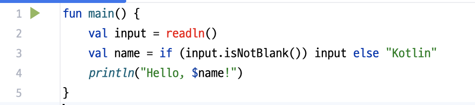
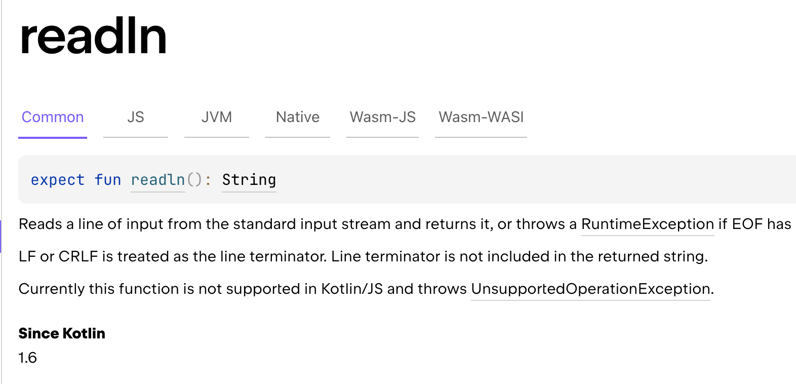

# 2장. 코틀린 기초

빌딩 블록?

- 특정 시스템을 구성하는 기본 단위

코틀린에서의 빌딩 블록

- 변수, 함수, 클래스
- 확장 함수, 고차 함수, 람다 표현식, 데이터 클래스
- suspend 함수, 코루틴 스코프, 디스패처

## 2.1 기본 요소: 함수와 변수

함수와 변수 → 모든 프로그램을 구성하는 기본 단위

### 2.1.1 첫 번째 코틀린 프로그램 작성

```kotlin
fun main() {
        println("Hello, world!")
}
```

- 함수를 코틀린 파일의 최상위 수준에 정의 가능 → 클래스 안에 넣을 필요 없음
- `println()` - Java의 표준 출력을 감싸는 wrapper 역할
    - Kotlin은 멀티 플랫폼 언어 - Java뿐만이 아니라 JS/Native 환경에서도 실행 가능
    - JVM에서는 `System.out.println()`을 호출
    - JavaScript에서는 `console.log()`
    - Native에서는 다른 출력 함수 사용
    
    → `println()`은 플랫폼 종속성을 감추고, 기존 Java 기능을 감싸면서, 더 직관적인 API를 제공하는 래퍼 함수!
    
- main은 코틀린 프로그램의 진입점
    - 파라미터가 있어도 되고 없어도 됨

### 2.1.2 파라미터와 반환값이 있는 함수 선언

```kotlin
fun max(a: Int, b:Int): Int {
        return if (a > b) a else b
}
```

| 식 | 문 |
| --- | --- |
| 값을 만들어냄 | 값을 만들어내지 않음 |
| 다른 식의 하위 요소 | 자신을 둘러싸고 있는 가장 안쪽 블록의 최상위 요소 |
| 계산에 참여 가능 | 계산에 참여 불가 |
| if, when, try/catch 등 | for, while, do/while 등 |

### 2.1.3 식 본문을 사용해 함수를 더 간결하게 정의

- 블록 본문 함수
    - 중괄호로 둘러싸인 함수
    - 반환 타입 생략 불가
    - return문으로 반환값 명시 필요
    
    ```kotlin
    fun max(a: Int, b:Int): Int {
            return if (a > b) a else b
    }
    ```
    
- 식 본문 함수
    - 등호와 식으로 이루어진 함수
    - 반환 타입 생략 가능
    
    ```kotlin
    fun max(a: Int, b:Int) = if (a > b) a else b
    ```
    
- 타입 추론
    - 컴파일러가 함수 본문 식을 분석
    - 식의 결과 타입을 함수 반환 타입으로 지정

### 2.1.5 변수를 읽기 전용 변수나 재대입 가능 변수로 표시

- val
    - 읽기 전용 참조
    - 기본적으로 이거 사용하기를 권장
    - 변수가 정의된 블록 실행 시, 정확히 한 번만 초기화되어야 함
    - 참조만 읽기 전용, 참조가 가능한 객체의 내부 값은 가능
        - val mutableList에 추가 → 가능
- var
    - 재대입 가능한 참조
    - 변수의 타입은 고정
- 컴파일러는 변수 시점의 초기화 식으로부터 변수의 타입을 추론
- 변수 선언 이후 재대입이 이뤄질 때 → 추론한 타입을 염두에 두고 대입문의 타입 검사
    - 변환 함수 혹은 형 변환 해서 다른 타입 변수 할당

### 2.1.6 문자열 템플릿

```kotlin
fun main() {
    val input = readln()
    val name = if (input.isNotBlank()) input else "Kotlin"
    println("Hello, $name!")
}
```

- JVM 1.8 타깃 - `StringBuilder` 사용
- 그 이상 버전 타깃 - `invokedynamic` 사용
    - Jdk 9 이상에서는 `invokedynamic`(indy) 기반의 `StringConcatFactory`를 사용하여 문자열을 연결
    - 바이트코드 변환 시 jdk9 이상에서는 indy 명령어가 사용됨.
    - JVM이 런타임에 가장 적절한 방법으로 문자열을 연결
    - 필요에 따라 `StringBuilder`, `StringConcatFactory`, `StringBuffer` 등을 동적으로 선택하여 최적화

일부 sdk 버전에서 readln 인식 불가



- readln은 kotlin 1.6에 등장
- 프로젝트에 설정된 kotlin 버전이 낮으면 동작하지 않을 수 있음



→ readln은 kotlin 1.6부터 지원된다.

**문자열 템플릿 사용할 때는 변수 이름을 {중괄호}로 감싸는 것이 좋다.**

- 문자열 템플릿에 붙여 쓰면 변수로 인식할 수 있음
- $name님 반갑습니다 → name님 까지 변수로 인식
    - ${name}님 반갑습니다
- $input_derived is derived from $input → input_derived까지 변수로 인식
    - ${input}_derived is derived from ${input}

## 2.2 행동과 데이터 캡슐화: 클래스와 프로퍼티

클래스

- 데이터를 캡슐화
- 캡슐화한 데이터를 다루는 코드를 한 주체안에 가두는 것

코틀린의 클래스

```kotlin
class Person(val name: String)
```

- 코틀린의 기본 가시성은 public

### 2.2.1 클래스와 데이터를 연관시키고, 접근 가능하게 만들기: 프로퍼티

자바에서의 클래스

- 데이터를 필드에 저장
- 멤버 필드의 가시성은 보통 private
    - 필드에 접근하려면 getter 사용
    - 필드에 세팅하려면 setter 사용
- 자바의 프로퍼티 : 필드와 접근자 묶은 것

코틀린에서의 클래스

- 프로퍼티를 언어 기본 기능으로 제공
    - 자바의 필드/접근자 메서드(getter/setter)
- val/var로 선언

```kotlin
class Person (
    val name: String,           // getter만 생성
    var isStudent: Boolean      // getter/setter 모두 생성
)
```

- is로 시작하는 프로퍼티의 게터 - get이 붙지 않고 원래 이름 그대로 사용
    - isStudent
- set은 is를 set로 바꾼 것 사용
    - setStudent

```kotlin
fun main() {
    val person = Person("Bob", true)
    println(person.name)
    println(person.isStudent)
}
```

- 게터를 명시적으로 호출하는 대신 프로퍼티를 직접 사용

### 2.2.2 프로퍼티 값을 저장하지 않고 계산: 커스텀 접근자

온더고 프로퍼티

- 프로퍼티에 접근할 때 계산

커스텀 접근자

- 프로퍼티 접근자 커스텀 구현 가능
- 이 때 backing field가 생성됨 (4장에서 다룸)

커스텀 게터

```kotlin
fun main() {
    val rectangle = Rectangle(41, 43)
    println(rectangle.isSquare)
}

class Rectangle(val height: Int, val width: Int) {
    val isSquare: Boolean
        get() {
            return height == width
        }
}
```

커스텀 게터 정의 vs 게터 멤버 함수 정의

- 구현이나 성능 차이는 없음
- 가독성 차이
- 클래스의 **특성**을 기술하고자 할 때 → 프로퍼티
- 클래스의 **행동**을 기술하고자 할 때 → 멤버 함수

### 2.2.3 코틀린 소스코드 구조: 디렉터리와 패키지

패키지

- 클래스를 조직화하기 위해 사용
- 같은 패키지에 속해 있으면 → 다른 파일에 정의한 선언이라도 직접 사용 가능
- 다른 패키지에 정의한 선언 → Import 필요

코틀린에서의 Import

- 클래스, 함수, 프로퍼티, 확장 함수, 객체 등등 다 가져올 수 있음. java의 static import가 포함되었다고 보면 됨.
- 여러 클래스를 같은 파일에 넣을 수 있음
- 디스크상의 어느 디렉터리에 소스코드 파일을 위치시키든 관계 없음 → 자바처럼 구성하는 편이 낫다.

자바에서의 import

- 기본적으로 클래스만 가져올 수 있으며, 함수 가져오려면 static import 해야 함
- 패키지의 구조와 일치하는 디렉터리 계층 구조 만들어야 함
- 소스코드를 클래스가 속한 패키지와 같은 디렉터리에 위치시켜야 함

<aside>
💡

책에서는 와일드카드 임포트를 소개하고 있지만, ktlint에서는 와일드카드 임포트를 권장하고 있지 않는다.

- 런타임 성능에 영향을 주지 않음
- 개별 import할 경우 변경 관리가 쉬움
- https://github.com/pinterest/ktlint/blob/master/.editorconfig#L28
- `https://developer.android.com/kotlin/style-guide?hl=ko#import_statements`
</aside>

## 2.3 선택 표현과 처리: 이넘과 when

### 2.3.1 이넘 클래스와 이넘 상수 정의

코틀린에서의 enum → 소프트 키워드에 해당 (class 앞에 있을 때 만 특별한 의미로 사용)

자바에서의 enum → 하드 키워드에 해당 (어디에서든 사용 어려움)

이넘 → 클래스에 해당하므로 생성자/프로퍼티 선언 문법 사용 가능

메서드 선언시에는 이넘 상수 목록과 메서드 사이 세미콜론 필요 → 코틀린에서 유일하게 세미콜론이 필수인 부분

```kotlin
enum class Color {
    val r: Int,
    var g: Int,
    val b: Int
} {
    RED(255, 0, 0);   // 세미콜론 필요
    fun rgb() = (r * 256 + g) * 256 + b
}
```

### 2.3.2 when으로 이넘 클래스 다루기

값을 만들어내는 식

```kotlin
fun getColorName(color: Color) =
    when (color) {
        Color.RED -> "RED"
        Color.YELLOW, Color.BLUE -> "NOT RED"
    }
```

when식의 대상을 캡쳐하여 본문 안에서 캡쳐 대상 프로퍼티 접근 가능

```kotlin
fun getSensor() = {
    when (val color = measureColor()) {
        RED, ORANGE, YELLOW -> "warm (red = ${{color.r})"
    }
}
```

컴파일러는 when을 exhaustive하게 검사

- 조건 분기에 빠져있는 enum이 있으면 안 된다
- 빠져있으면 else로 디폴트 케이스 제공 필요 →  sealed class에서도 지원

enum class vs. sealed class

| 구분 | enum class | sealed class |
| --- | --- | --- |
| 용도 | 제한된 상수 집합 (고정된 값 목록) | 제한된 계층 구조 내 다양한 타입의 표현 |
| 인스턴스 | 각 항목은 싱글턴이며 미리 정의된 인스턴스 | 하위 클래스는 일반 클래스처럼 인스턴스를 여러 개 생성 가능 |
| 확장성 | 고정되어 있어 추가적인 하위 타입 생성 불가 | 같은 파일 내에서 자유롭게 새로운 하위 클래스를 추가 가능 |
| 데이터 표현 | 간단한 상수 값 표현에 적합 | 복잡한 데이터나 다양한 형태의 상태를 표현하는 데 적합 |
| 사용 예 | 요일, 방향, 상태 등 | 여러 가지 연산, 이벤트, 결과 등의 다양한 형태의 표현 |
| 상태 저장 가능 | 각 상수는 고정된 값이며, 별도의 상태 저장 어려움 | 하위 클래스에 상태(변수)를 추가 가능 |
| 생성자 | 생성자를 가질 수 있지만, 모든 인스턴스가 같은 구조를 가져야 함 | 하위 클래스마다 다른 생성자를 가질 수 있음 |
| 컴파일러의 `when` 체크 | 모든 `enum` 값을 `when`에서 체크하지 않으면 경고 발생 (오류 아님) | 모든 서브클래스를 `when`에서 체크하지 않으면 컴파일 오류 발생 |
| 유지보수성 | 새로운 `enum` 상수를 추가하면 모든 `when`에 영향을 미칠 가능성이 큼 | 새로운 하위 클래스를 추가하면 소스코드를 변경하지 않는 한 기존 코드에는 영향 없음 |

when의 분기 조건에 임의의 객체 사용

```kotlin
fun mix(c1: Color, c2: Color) = 
    when(serOf(c1, c2)) {
        setOf(RED, YELLOW) -> ORANGE
        else -> throw Exception("Nothing")
    }
```

- when식은 인자 값과 일치하는 조건 값을 찾을 때  까지 각 분기 검사 → 동등성 사용 (동일성 X)

인자 없는 when

```kotlin
fun mixOptimized(c1: Color, c2: Color) =
    when {
        (c1 == RED  && c2 == YELLOW) -> ORANGE
        else -> throw Exception("Dirty Color") // 식으로 사용하기에 이 when은 철저해야 함
    }
```

- 가독성 떨어짐
- 가비지 컬렉터가 수거할 필요가 있는 짧게 살아있는 객체가 늘어나는 것을 방지하고자 할 때 사용
- 아무 인자도 없으면 각 분기의 조건이 boolean 결과를 계산하는 식이어야 함

### 2.3.6 스마트 캐스트: 타입 검사와 타입 캐스트 조합

마커 인터페이스

- 여러 타입의 식 객체를 아우르는 공통 타입 역할만 수행하는 인터페이스

is 검사

- 변수의 구체적 타입을 검사
- 스마트 캐스트 실행

스마트 캐스트

- 타입이 확인되면 → 그 타입을 사용하기 위해 추가적으로 타입 변환 할 필요 없음

명시적 타입 캐스팅 → is 대신 as 사용

### 2.3.8 if와 when의 분기에서 블록 사용

분기에서 블록을 사용할 경우 → 블록의 맨 마지막 문장이 블록 전체의 결과

→ 블록이 값을 만들어내야 하는 경우 항상 성립

함수 → 블록이 아닌 식이 본문이 되거나 / 블록이 본문되 블록 내부에 명시적인 return문이 있어야 함

## 2.4 대상 이터레이션: while과 for 루프

### 2.4.1 while

중첩 loop → lable 지정 및 참조 가능

```kotlin
outer@while (outerCondition) {
        while (innerCondition){
            if(shouldExitInnter) break
            if(shouldExitOuter) break@outer
        }
    }
```

### 2.4.2 수에 대해 이터레이션: 범위와 순열

범위 (.. 연산자)

- 두 값으로 이뤄진 구간
- 폐구간 → 양끝을 포함한 구간

```kotlin
for (i in 0 .. 3) {
        println(i) // 0, 1, 2, 3
    }
```

순열(progression)

- 범위에 속한 값을 일정한 순서로 이터레이션

downTo : 반복하면서 감소

```kotlin
for (i in 3 downTo 1) {
    println(i)  // 3, 2, 1
}
```

step : 증가량 설정 가능

```kotlin
for (i in 0 .. 6 step 2){
    println(i) // 0, 2, 4, 6
}
```

반만 닫힌 범위(half-closed range)

- ..<

```kotlin
for (i in 0 ..< 3) {
    println(i) // 0, 1, 2
}
```

- until

```kotlin
for (i in 0 until 3) {
    println(i) // 0, 1, 2
}
```

### 2.4.3 맵에 대해 이터레이션

컬렉션 이터레이션

```kotlin
val numbers = arrayOf(1, 2, 3)

for(i in numbers) {
    println(i) // 1, 2, 3
}

for(i .. numbers) {
    println(i) // 1, 2, 3
}

for(char in 'A' .. 'F') {
        println(char)  // A, B, C, D
}
```

### 2.4.4 in으로 컬렉션이나 범위의 원소 검사

in과 !in을 통해 어떤 값이 범위에 속하는지 아닌지 검사 가능

Comparable 인터페이스를 구현한 객체라면 in 연산 사용 가능

## 2.5 코틀린에서 예외 던지고 잡아내기

코틀린의 try, throw는 식에 해당

### 2.5.1 try, catch, finally를 사용한 예외 처리와 오류 복구

Checked Exception

- 명시적으로 처리해야만 하는 예외
- 처리 안하면 컴파일러단에서 오류
- 함수가 던질 수 있는 모든 에러 선언 필요
- 함수가 다른 함수를 호출할 경우 → 그 함수에 선언된 체크 예외를 모두 잡거나 다시 위로 던져야 함
- 많은 개발자들이 checked exception도 의미 없이 돈지는 경우가 너무 많다.. → 의미 없다고 판단해서 코틀린에서는 구분하지 않음

Unchecked Exception

- Java에서는 RuntimeException이 Unchecked Exception에 해당