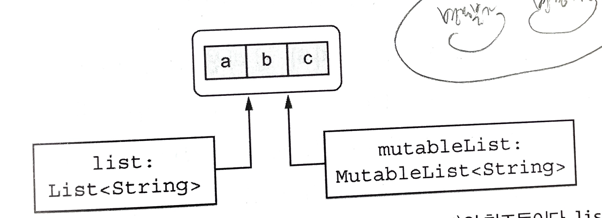
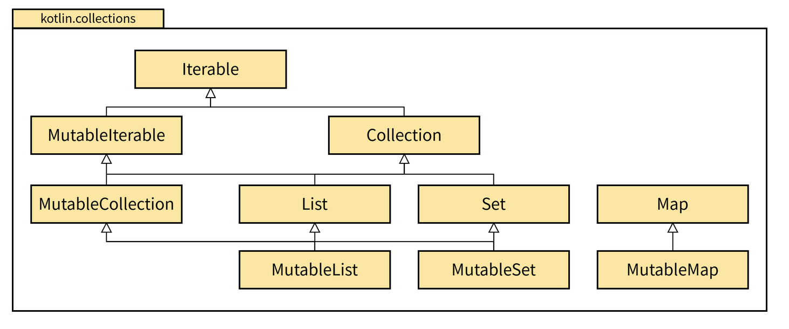

# 8장. 기본 타입, 컬렉션, 배열

# 8.1 원시 타입과 기본 타입

코틀린 → 원시 타입과 래퍼 타입을 구분하지 않음

## 8.1.1  정수, 부동소수점 수, 문자, 불리언 값을 원시 타입으로 표현

자바 → 원시 타입 / 참조 타입을 구분 O

코틀린 → 원시 타입 / 참조 타입 구분 X

- 실행 시점에 가장 효율적인 방식으로 표현
    - 자바의 int 타입으로 컴파일
    - 컴파일이 불가능할 경우 래퍼 타입

## 8.1.2 양수를 표현하기 위해 모든 비트 범위 사용: unsigned type

부호 있는 타입의 범위를 시프트 → 같은 크기의 메모리를 사용해 더 큰 수 표현

unsigned type의 구현

- JVM 자체에서는 unsigned 원시 타입을 제공하지 않음
- 기존의 signed 원시 타입 위에 추상화 제공

→ 코틀린의 인라인 클래스를 통해 추상화를 제공하고 있음

## 8.1.3 널이 될 수 있는 기본 타입: Int? Boolean?

자바 원시 타입은 null이 될 수 없음

→ 코틀린의 null이 될 수 있는 기본 타입은 자바의 래퍼 타입으로 컴파일

```kotlin
val listOfInts = listOf(1, 2, 3)
```

→ 위와 같은 리스트는 원시 타입의 배열로 구현되어 있음

→ 하지만 래퍼 타입(Integer)로 컴파일된다!

- JVM은 타입 인자로 원시 타입을 허용하지 않음
- 자바나 코틀린이나 제네릭 클래스는 항상 박스 타입!

## 8.1.4 수 변환

```kotlin
val i = 1
val l: Long = i  // Error. Type mismatch 컴파일 오류 발생
```

- 코틀린에서는 자동으로 수를 변환해주지 않음
- 결과 타입이 허용하는 수의 범위보가 원래 타입의 범위보다 넓어도 자동 변환되지 않음

타입 변환 메서드

- toByte(), boShort(), toChar() 등..
- 양방향 변환 함수 모두 제공
- 범위가 좁아지면서 값을 벗어나면 일부를 잘라내기도 함
- 예상치 못한 동작을 막기 위해 명시적으로 타입을 변환해서 쓰도록 되어 있음

원시 타입 리터럴

- 코틀린은 수 리터럴을 허용
- Long의 L, 표준 부동소수점 표기법의 Double 등등..
- 숫자 리터럴을 사용하면 변환 함수를 호출할 필요가 없음 → 컴파일러가 필요한 변환을 자동으로 넣어줌

문자열을 수로 변환하기

- toInt, toByte, toBoolean
    - 문자열을 원시 타입으로 변환
    - 파싱에 실패하면 NumberFormatException
- toIntOrNull, toByteOfNull
    - 문자열 변환에 실패 시 Exception을 던지지 않고 null을 돌려줌
- toBoolean
    - 문자열의 내용이 단어 true와 같으면 true, 그 외의 경우 false 반환
- toBooleanStrict
    - 정확히 true와 false를 받을 때 사용
    - 그렇지 않은 경우에는 예외 발생

## 8.1.5 Any와 Any?: 코틀린 타입 계층의 뿌리

Any 타입

- 모든 널이 될 수 없는 타입의 조상 타입
- 자바에서는 원시 타입이 Object에 포함되지 않지만, 코틀린은 원시 타입의 역할을 하는 기본 타입이 Any에 포함되어 있음.
- Any는 널이 될 수 없으므로, 널을 받으려면 Any?와 같이 받아야 함

## 8.1.6 Unit 타입: 코틀린의 void

코틀린의 Unit → 자바의 void 와 같은 기능

- 관심을 가질 만한 내용을 반환하지 않는 경우
- 반환 타입 선언 없이 정의한 블록이 본문인 함수의 타입

자바의 void와 차이점

- 타입에 해당하며, 타입 인자로 쓸 수 있음
- Unit 타입은 Unit이란 값을 갖고 있음’

## 8.1.7 Nothing 타입: 이 함수는 결코 반환되지 않는다

반환값이라는 개념 자체가 의미가 없는 함수

- 예: 예외를 throw하는 경우를 표현하고자 함(비정상 종료)
- 아무 값도 포함하지 않음
- 함수의 반환 타입이나 반환 타입으로 쓰일 타입 파라미터로만 사용 가능

# 8.2 컬렉션과 배열

## 8.2.1 널이 될 수 있는 값의 컬렉션과 널이 될 수 있는 컬렉션

| 컬렉션 자체 | 컬렉션의 요소 |
| --- | --- |
| nullable | nullable |
| nullable | not null |
| not null | nullable |
| not null | not null |

→ 각각의 경우는 다른 경우

filterNotNull → null값을 걸러내는 함수

## 8.2.2 읽기 전용과 변경 가능한 컬렉션

코틀린에서는 컬렉션 인터페이스 분리

- 컬렉션 안의 데이터에 접근하는 인터페이스 → Collection 인터페이스
- 컬렉션 안의 데이터를 변경하는 인터페이스 → MutableCollection 인터페이스

→ 가능하면 Collection(변경 불가) 인터페이스를 사용하자.



읽기 전용 컬렉션으로 참조한 리스트는 반드시 변경이 불가능한 것은 아님.

위의 케이스와 같이 컬렉션 인스턴스를 가리키는 참조 중 하나일 뿐

→ 다중 스레드 환경에서 컬렉션을 다룰 경우 동기화 및 동시 접근에 신경써야 한다.

## 8.2.3 코틀린 컬렉션과 자바 컬렉션은 밀접히 연관됨



- 각 변경 가능 인터페이스는 자신과 대응하는 읽기 전용 인터페이스를 확장함
- 읽기 전용 인터페이스에는 컬렉션을 변경할 수 있는 모든 요소가 빠져 있음
- 코틀린에서 Collection 인터페이스를 사용했더라도 자바에서 이를 받으면 변경할 수 있음 → 자바로 넘길 때 주의 필요

## 8.2.4 자바에서 선언한 컬렉션은 코틀린에서 플랫폼 타입으로 보임

코틀린은 자바의 플랫폼 타입의 변경 가능성을 알 수 없음.

아래 내용이 컬렉션 타입에 반영되어야 함

- 컬렉션 자체가 null이 될 수 있는지?
- 컬렉션의 원소가 null이 될 수 있는지?
- 작성할 메서드가 컬렉션을 변경할 수 있는지?

## 8.2.5 성능과 상호운용을 위해 객체의 배열이나 원시 타입의 배열을 만들기

웬만해서는 배열보다는 컬렉션 사용이 권장됨

→ 자바 API와의 호환성을 지키기 위해 배열을 사용해야 하는 경우가 생김

코틀린에서 배열을 만드는 방법

1. arrayOf
    1. 인자로 받은 원소들을 포함하는 배열
2. arrayOfNulls
    1. 모든 원소가 null인 정해진 크기의 배열
3. Array 생성자
    1. 배열 크기와 람다를 인자로 받아 람다를 호출해서 각 배열 원소를 초기화

Array<Int> → 박싱된 정수의 배열(Integer[])으로 컴파일

박싱되지 않은 원시타입의 배열을 가져오려면 → 다른 배열 클래스 사용 필요

- IntAray, ByteArray, CharArray, BooleanArray 등

원시 타입의 배열을 만드는 방법

1. 배열 타입의 생성자로 size 인자를 받아 → 기본값으로 초기화된 배열 반환
    
    ```kotlin
    val fiveZeros = IntArray(5)
    ```
    
2. 팩토리 함수(intArrayOf) 사용
    
    ```kotlin
    val fiveZeros = intArrayOf(0, 0, 0, 0, 0)
    ```
    
3. 크기와 람다를 받는 생성자 사용
    
    ```kotlin
    val squares = IntArray(5) { i -> (i +1) * (i + 1) }
    ```