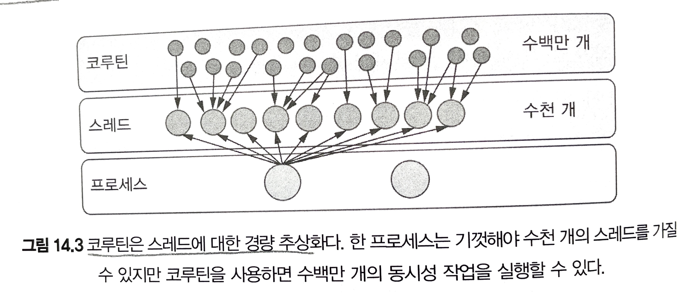
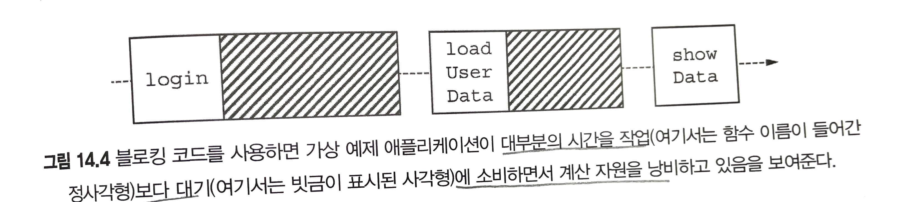
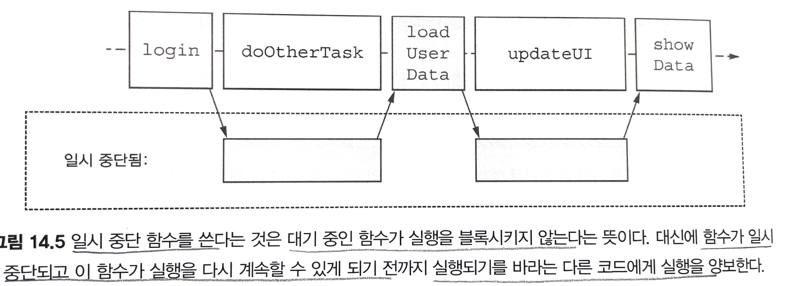

# 14장. 코루틴

# 14.1 동시성과 병렬성

동시성(concurrency)

- 여러 작업을 동시에 실행하는 것
- 물리적으로 함께 실행할 필요는 없음
- 코드의 여러 부분을 돌아가면서 실행하는 것도 포함
- 코드를 여러 부분으로 나눠서 동시에 수행할 수 있는 능력

병렬성(parallelism)

- 여러 작업을 물리적으로 동시에 실행하는 것

# 14.2 코틀린의 동시성 처리 방법: 일시 중단 함수와 코루틴

코루틴

- 비동기적으로 실행되는 넌블로킹 동시성 코드를 작성할 수 있게 해 줌

일시 중단 함수(suspending)

- 스레드를 블록시키지 않음
- 순차적 코드처럼 보이는 동시성 코드 작성 가능

# 14.3 스레드와 코루틴 비교

스레드

- 서로 독립적으로 동시에 실행되는 코드 블록 지정 가능
- 시스템 스레드 사용 시 비용 발생
    - OS에서 관리, 스레드간 전환 시 비용 발생 등등
- 독립적인 프로세스로 존재

코루틴

- 생성하고 관리하는 비용이 저렴한 초경량 추상화
- 시스템 자원을 블록시키지 않고 실행을 일시 중단
    - 중단된 시점에서 실행 재개 가능
    - 비동기 작업 처리 시 블로킹 스레드보다 효율적
- 구조화된 동시성 (15장 내용)
- 하나 이상의 JVM 스레드에서 실행
    - 기본 스레드 모델이 제공하는 병렬성 활용
    - 스레드의 한계에서 조금 자유로움



프로젝트 룸

- jvm에 가상 스레드 형태의 경량 동시성을 도입
- jvm 스레드와 운영체제 스레드간의 일대일 결합을 해소하려는 노력
- 기존의 I/O 중심 레거시 코드를 가상 스레드로 포팅
    - 빠른 로컬 계산과 네트워크로부터 예측할 수 없는 시간 동안 정보를 기다려야 하는 함수 사이에 언어 수준 구분이 없음
- 아직 실험적인 개념

# 14.4 잠시 멈출 수 있는 함수: 일시 중단 함수

suspend 사용 → 코드 형태를 크게 변경하지 않고 일시 중단 가능

## 14.4.1 일시 중단 함수를 사용한 코드는 순차적으로 보인다

순차 작업 코드

```kotlin
fun login(credentials: Credentials): UserID
fun loadUserData(userID: UserID): UserData
fun showData(data: UserData)

fun showUserInfo(credentials: Credentials) {
		val userID = login(credentials)
		val userData = loadUserData(userID)
		showData(userData)
}
```



- showUserInfo함수가 스레드를 블록시킴
    - 블록된 스레드는 자원을 낭비함
- 대부분의 시간을 작업보다 대기에 소비하면서 계산 자원을 낭비함

일시 중단 함수를 사용한 구현

```kotlin
suspend fun login(credentials: Credentials): UserID
suspend fun loadUserData(userID: UserID): UserData
fun showData(data: UserData)

suspend fun showUserInfo(credentials: Credentials) {
		val userID = login(credentials)
		val userData = loadUserData(userID)
		showData(userData)
}
```



- suspend 변경자
    - 함수가 실행을 잠시 멈출 수도 있다.
    - 일시 중단은 기저 스레드를 블록시키지 않는다
    - 함수 실행이 일시 중단되면 다른 코드가 같은 스레드에서 실행될 수 있다.
- 코드는 순차적으로 보이지만 중단된 사이에 다른 작업을 수행할 수 있다.

# 14.5 코루틴을 다른 접근 방법과 비교

콜백

- 함수 호출 시 콜백 파라미터 제공 필요
- 콜백 지옥 발생 가능성 큼
- 인지적 부가 비용 발생, 새로운 연산자를 코드에 도입해야 함
    - CompletableFuture → thenAccept
    - 반응형 스트림의 경우 함수 시그니처 변경 필요

## 14.5.1 suspend function 호출

suspend function

- 실행을 일시 중단
    - 일반 코드 아무 곳에서나 호출할 수 없음
- suspend된 코드 블록 안에서만 호출 가능
- 함수가 실행을 일시 중단할 수 있다면 → 그 함수를 호출하는 함수의 실행도 잠재적으로 일시 중단될 수 있다.

→ 그러면 어떻게 suspend를 호출할 수 있을까?

1. main을 suspend로
    1. main 함수의 시그니처 변경은 어려움
2. 코루틴 빌더 함수 사용
    1. 현실적인 방법

# 14.6 코루틴의 세계로 들어가기: 코루틴 빌더

코루틴 → 일시 중단 가능한 계산의 인스턴스

- 다른 코루틴들과 동시에 실행될 수 있는 코드 블록
- 생성 시 코루틴 빌더 함수 중 하나 사용

## 14.6.1 일반 코드에서 코루틴의 세계로: runBlocking

runBlocking

- 일반 블로킹 코드를 suspend 세계로 연결
- 새 코루틴을 생성하고 실행
- 해당 코루틴이 완료될 때 까지 현재 스레드를 블록
- 하나의 스레드를 블로킹
    - 블로킹한 코루틴 안에서 추가적인 자식 코루틴을 얼마든지 시작
    - 자식 코루틴은 다른 스레드를 블록시키지 않음
    - 일사 중단될 때마다 하나의 스레드가 해방돼 다른 코루틴이 코드를 실행

## 14.6.2 fire and forget coroutine 생성: launch

launch

- 새로운 자식 코루틴을 시작하는데 사용
- 어떤 코드를 실행하되 그 결괏값을 기다리지 않음
- 코루틴 내부에서 값을 반환하는데 사용되기는 어려움
- 파일이나 데이터베이스에 쓰는 작업과 같은 → 시작 후 신경 쓰지 않아도 되는 작업에 적합함

일시 중단된 코루틴이 가는 곳

- 컴파일러는 코루틴을 일시 중단하고 재개함
- 스케줄링하는 데 필요한 지원 코드를 생성
- 일시 중단 함수의 코드는 컴파일 시점에 변환
- 실행 시점에 코루틴이 일시 중단될 때 해당 시점의 상태 정보가 메모리에 저장됨

## 14.6.3 대기 가능한 연산: async

async

- 비동기 계산을 수행
- 반환 타입은 Deferred<T> 인스턴스
    - await라는 일시 중단 함수로 그 결과를 기다리는 것
    - Deferred: 아직 사용할 수 없는 값
        - 값을 계산하거나 어디서 읽어와야 함
        - 미래에 언젠가는 값을 알게 될 것이라는 약속
- async를 호출한다고 해서 코루틴이 일시 중단되지는 않음
    - await을 호출하면 Deferred에서 결괏값이 사용가능해질 때 까지 루트 코루틴이 일시 중단됨

## 코루틴 빌더 정리

| 빌더 | 반환값 | 쓰임새 |
| --- | --- | --- |
| runBlocking | 람다가 계산한 값 | 블로킹 코드와 넌블로킹 코드 사이를 연결 |
| launch | Job | fire and forget 코루틴 시작 (부수 효과가 있음) |
| async | Deferred<T> | 값을 비동기로 계산 (값을 기다릴 수 있음) |
- 코루틴은 스레드 위에 만들어진 추상화
- runBlocking은 함수를 호출한 스레드에서 실행

# 14.7 어디서 코드를 실행할지 정하기: 디스패처

디스패처

- 코루틴을 실행할 스레드를 결정
- 코루틴을 특정 스레드로 제한하거나 스레드 풀에 분산 가능
- 한 스레드에서 실행될지 여러 스레드에서 실행될지 결정
- 코루틴은 특정 스레드에 고정되지 않음
- 한 스레드에서 실행을 일시중단하고 디스패처가 지히새는 대로 다른 스레드에서 실행을 재개할 수 있음

스레드 풀

- 스레드 집합을 관리
- 집한에 속한 스레드들 위헤서 작업 실행을 허용
- 일정한 수의 스레드를 유지하면서 내부 논리와 구현에 따라 들어오는 작업을 분배함

## 14.7.1 디스패처 선택

코루틴은 기본적으로 부모 코루틴에서 디스패처를 상속받음 → 하지만 디스패처 선택 가능!

### Dispatchers.Default

- 다중 스레드를 사용하는 범용 디스패처
- 일반적인 작업에 사용
- CPU 코어 수만큼의 스레드로 구성된 스레드 풀을 기반
- 기본 디스패처에서 코루틴을 스케줄링 → 여러 스레드에서 코루틴이 분산돼 실행
- 멀티코어 시스템에서는 병렬로 실행
- 코루틴은 스레드를 블로킹하고 일시 중단 → 단일 스레드에서도 수천 개의 코루틴 처리 가능

### Dispathcers.Main

- UI 프레임워크 사용 시 특정 작업을 특정 스레드에서 실행해야 함

### Dispatchers.IO

- 데이터베이스 시스템과 상호작용하는 블로킹 API를 사용해야 하는 경우
- 이 디스패처에서 실행된 코루틴은 자동으로 확장되는 스레ㅔ드 풀에서 실행
- CPU 집약적이지 않은 작업에 적합함

### 특수 디스패처 & 커스텀 디스패처

Unconfined

- 특정 스레드에 제약되지 않고 코루틴이 실행
- 즉시 스케줄링해야 하는 특별한 경우

limitedParallelism

- 디스패처에 대한 병렬성 제약을 사용자 정의
- 커스텀 시나리오에 사용

## 14.7.2 코루틴 빌더에 디스패처 전달

코드 → 부모 코루틴의 디스패처에서 실행됨

코루틴을 특정 디스패처에서 실행하기 위해 코루틴 빌더 함수에게 디스패처를 인자로 전달 가능함

코루틴 빌더 함수는 코루틴 디스패처를 명시적으로 지정 가능

```kotlin
fun main() {
		runBlocking() {
				log("Doing some work")
				launch(Dispatchers.Default) {
						log("Doingsome background work")
				}
		}
}
```

- log 호출은 메인 스레드에서 실행
- 두 번째 호출은 디본 디스패처 스레드 풀에 속한 스레드에서 실행

## 14.7.3 withContext를 사용해 코루틴 안에서 디스패처 바꾸기

withContext

- 코루틴의 어떤 부분이 어디서 실행될지를 제어
- 코드가 특정 스레드에서 실행되도록 보장
- 이미 실행중인 코루틴에서 디스패처를 바꿀 때 사용

```kotlin
launch(Dispathcers.Default) {  // 디폴트 디스패처에서 실행
		val result = performBackgroundOperation()
		withContext(Dispatchers.Main) {  // 디스패처를 메인 디스패처로 변경
				updateUI(result)
		}
}
```

- 다중 스레드 디스패처 → 코루틴을 여러 스레드에 분산시켜 싱행
- 한 코루틴은 항상 순차적으로 실행
    - 어느 단일 코루틴의 어떤 부분도 병렬로 실행되지는 않음
    - 단일 코루틴은 동기화 문제를 일으키지 않는다
- 여러 코루틴의 경우 복잡함!

코루틴 사용 시 → 동시성 문제 발생 가능!

- Mutext 잠금을 사용해 임계 영역 설정 필요
- 스레드 안전한 데이터 구조(AtomicInteger, ConcurrentHashMap) 사용

# 14.8 코루틴 콘텍스트

CoroutineContext

- 코루틴의 추가적인 문맥 정보
- 디스패처 정보, 생명주기 관리 정보, 메타데이터 포함
- 코루틴 빌더나 withContext함수에 인자를 전달하면 자식 코루틴의 콘텍스트에서 해당 요소를 덮어씀