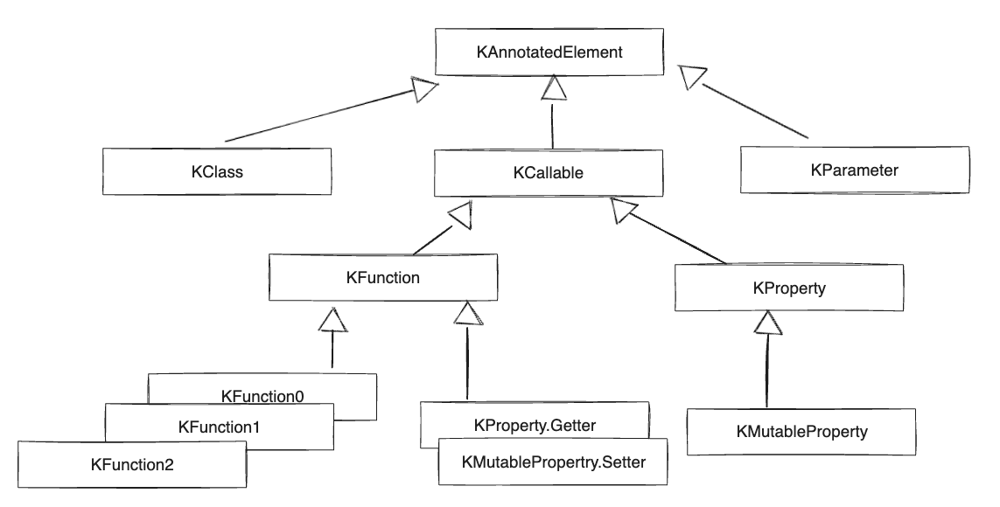

# Chapter 12. 어노테이션과 리플렉션

- 어노테이션 적용과 정의
- 리픅렉션을 사용해 실행 시점에 객체 내부 관찰하기
- 코틀린 실전 프로젝트 예제

## 12.1 어노테이션 선언과 적용

### 12.1.1 어노테이션을 적용해 선언에 표지 남기기

- Dprecated어노테이션 옵션
  - message: 중단 이유
  - replaceWith: 이전 버전을 대신할 수 있는 패턴 제시
  - level: WARNING(경고), ERROR(컴파일 막기), HIDDEN(예전에 컴파일된 코드와의 이진 호환성 유지)

```kotlin
@Deprecated("Use removeAt(index) instrea.", ReplaceWith("removeAt(index)"))
fun remove(index: Int) { /*... */}
```

- 코틀린에서 어노테이션 인자를 지정하는 문법
  - 클래스를 어노테이션 인자로 지정: `DeserializeInterface(CompanyImpl::class)`
  - 다른 어노테이션을 인자로 지정: @ 를 제외하고 인자로 지정. 앞선 ReplaceWith도 어노테이션임
  - 배열을 인자로 지정: `@RequestMapping(path = ["/foo", "/bar"]`

- 어노테이션 인자는 컴파일 시점에 알 수 있어야 하기에 프로퍼티를 인자로 사용하려면 const 변경자를 붙여야 함

### 12.1.2 어노테이션이 참조할 수 있는 정확한 선언 지정: 어노테이션 타깃

- 사용 지점 타깃(use-site target) 선언을 통해 어노테이션을 붙일 요소를 정할 수 있음
  - `@get:JvmName("obtainCertificate")` get->사용지점타깃, JvmName->어노테이션 이름

- 사용 지점 타깃 목록
  - property: 프로퍼티 전체
  - field: 프로퍼티에 의해 생성되는 필드
  - get: 프로퍼티 게터
  - set: 프로퍼티 세터
  - receiver: 확장 함수나 프로퍼티의 수신 객체 파라미터
  - param: 생성자 파라미터
  - setparam: 세터 파라미터
  - delegate: 위임 프로퍼티의 위임 인스턴스를 담아둔 필드
  - file: 파일 안에 선언된 최상위 함수와 프로퍼티를 담아두는 클래스

### 12.1.3 어노테이션을 활용해 JSON 직렬화 제어

```kotlin
data class Person(val name: String, val age: Int)

fun main() {
    val person = Person("Alice", 29)
    val json = serialize(person) // {"age": 29, "name": "Alice"}
    deserialize(json) // Person(name=Alice, age=29)
}
```

- @JsonExclude: 직렬화나 역직렬화할 때 무시해야하는 프로퍼티 표시
- @JsonName: 프로퍼티 이름 대신 어노테이션이 지정한 문자열을 쓰게 함

```kotlin
data class Person(
  @JsonName("alias")val name: String, 
  @JsonExclude val age: Int
  )

fun main() {
    val person = Person("Alice", 29)
    val json = serialize(person) // {"alias" "Alice"}
    deserialize(json) // Person(name=Alice)
}
```

### 12.1.4 어노테이션 선언

`annotation class JsonName(val name: String)`

### 12.1.5 메타어노테이션: 어노테이션을 처리하는 방법 제어

- 메타어노테이션: 어노테이션 클래스에 적용할 수 있는 어노테이션. @Target 등이 이에 속함

### 12.1.6 어노테이션 파라미터로 클래스 사용

```kotlin
interface Company {
    val name: String
}

data class CompanyImpl(override val name: String): Company

data class Person(
  val name: String, 
  @DeserializeInterface(CompanyImpl::class) val company: Company
  )
```

- 역질렬화 과정에서 company 프로퍼티를 표현하는 JSON을 읽으면 CompanyImpl의 인스턴스를 만들어 Person 인스턴스의 company 프로퍼티에 설정

## 12.2 리플렉션: 실행 시점에 코틀린 객체 내부 관찰

- 정적인 접근이 아닌 타입과 관계없이 객체를 다루거나 객체가 제공하는 메서드나 프로퍼티 이름을 런타임에만 알 수 있을 때 리플렉션 사용

### 12.2.1 코틀린 리플렉션 API: KClass, KCallable, KFunction, KProperty

- KClass 인스턴스 획득 방법

```kotlin

import kotlin.reflect.full.memberProperties

class Person(val name: String, val age: Int)

fun main() {
  val person = Person("Alice", 29)
  val kClass = person::class

  println(kclass.simpleName) // Person
  kClass.memberProperties.forEach{ println(it.name) } // age, name
}
```

```kotlin

interface KClass<T : Any> {
  val simpleName: String?
  val qualifiedName: String?
  val members: Collection<KCallable<*>>
  val constructors: Collection<KFunction<T>>
  val nestedClasses: Collection<KClass<*>>
}
```



### 12.2.2 리플렉션을 사용해 객체 직렬화 구현

```kotlin
private fun StringBuilder.serializeObject(obj: Any) {
    val kClass = obj::class as KClass<Any>
    val properties = kClass.memberProperties
  
    properties.joinToStringBuilder(
        this, prefix = "{", postfix = "}") { prop ->
            serializeString(prop.name) // 프로퍼티 이름
            append(": ")
            serializePropertyValue(prop.get(obj)) // 프로퍼티 value
    }
}
```

### 12.2.3 어노테이션을 활용해 직렬화 제어

```kotlin
private fun StringBuilder.serializeObject(obj: Any) {
  (obj::class as KClass<Any>)
    .memberProperties
    .filter { it.findAnnotaion<JsonExclude>() == null }
    .joinToStringBuilder(this, prefix = "{", postfix = "}") {
      serializeProperty(it, obj)
    }
  
  
    val kClass = obj::class as KClass<Any>
    val properties = kClass.memberProperties
  
    properties.joinToStringBuilder(
        this, prefix = "{", postfix = "}") { prop ->
            serializeString(prop.name) // 프로퍼티 이름
            append(": ")
            serializePropertyValue(prop.get(obj)) // 프로퍼티 value
    }
}
```